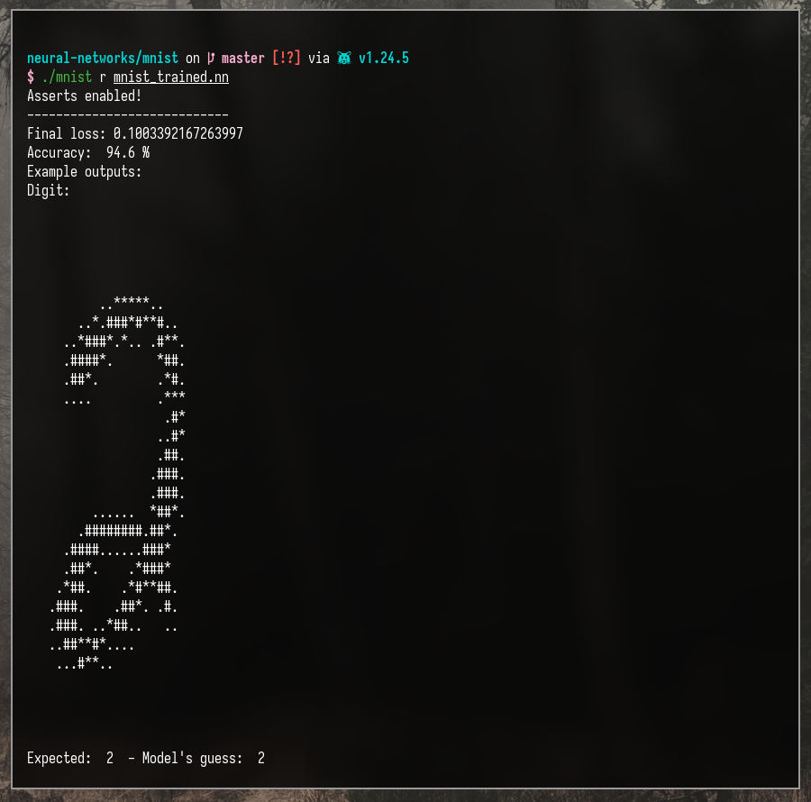

# Neural Networks

Basic Neural Network framework implemented from scratch in golang. Includes a multi-dimensional tensor implementation.


Features:
- Arbitrary n-dimensional tensors.
- Multiple activation functions (Sigmoid, ReLU).
- Fully connected layers.
- Backpropagation.
- Concurrent/Multi-threaded training (CPU only).
- Neural Net saving and loading from files (or any io.Reader/io.Writer)

## Getting Started

Clone the repository:

``` sh
git clone https://github.com/ManuelGarciaF/neural-networks.git
cd neural-networks
```

Run the simple demo (trains & tests Adder, AND, XOR neural nets):

``` sh
go run main.go
```

You can pass `-v` to print some network outputs during training:

``` sh
go run main.go -v
```

## MNIST Example
For a more advanced demonstration, this project includes a script for training a neural network to recognize handwritten digits from the MNIST dataset. We use a network with the following architecture:

Image created with [NN SVG](https://alexlenail.me/NN-SVG/index.html)

To train and test the network and save the resulting model, run the following commands:
``` sh
cd mnist
go build --tags noasserts
./mnist train
```

This will save the trained model as `mnist.nn`. To evaluate the saved model at any time, simply run:

``` sh
./mnist run mnist.nn
```

The MNIST network gets good results after ~8 minutes of training on a Ryzen 5 5600 CPU. For convenience, a pre-trained model (`mnist_trained.nn`) is included, which achieves 94.6% accuracy on the test set.

The script prints example predictions from the test data.


## Profiling
``` sh
cd nn
go test --tags noasserts -cpuprofile cpu.prof -bench=. .
```
