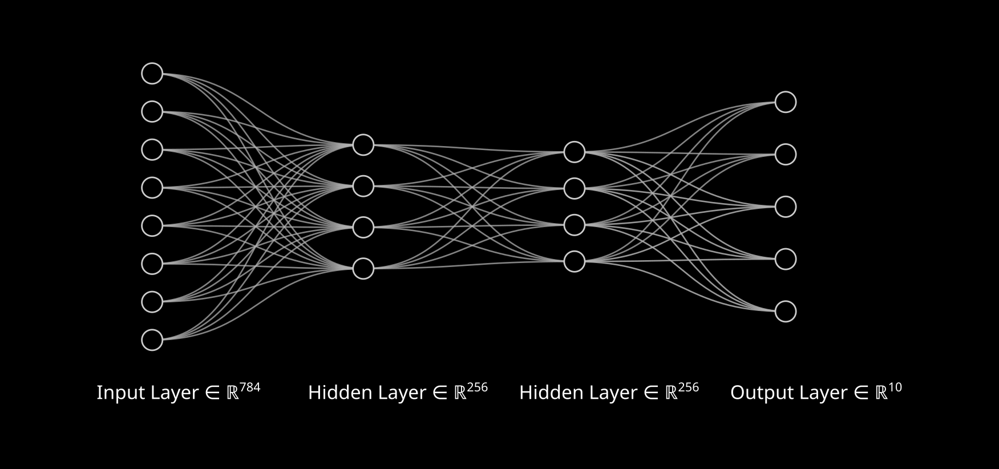

# Neural Networks

Basic Neural Network framework implemented from scratch in golang. Includes a multi-dimensional tensor implementation.


Features:
- Arbitrary n-dimensional tensors.
- Multiple activation functions (Sigmoid, ReLU, LeakyReLU, etc.).
- Fully connected layers.
- Backpropagation.
- Concurrent/Multi-threaded training (CPU only).

## Getting Started

Clone the repository:

``` sh
git clone https://github.com/ManuelGarciaF/neural-networks.git
cd neural-networks
```

Run the main demo (trains & tests Adder, AND, XOR neural nets):

``` sh
go run main.go
```

You can pass `-v` to print some network outputs during training:

``` sh
go run main.go -v
```

## MNIST Example
For a more complicated example, there is a script provided for training a network to solve MNIST handwritten digit recognition. We use a network with the following architecture:

Image created with [NN SVG](https://alexlenail.me/NN-SVG/index.html)

``` sh
cd mnist
go run --tags noasserts main.go
```

The MNIST network gets good results after ~8 minutes of training on a Ryzen 5 5600 CPU. The script prints example predictions from the test data.


## Profiling
``` sh
cd nn
go test --tags noasserts -cpuprofile cpu.prof -bench=. .
```
